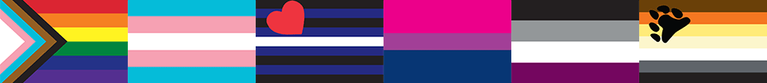

# LGBTQ+ Pride Flag Stickers

This repository contains a collection of over 30 graphic assets representing various LGBTQ+ Pride flags.

## Asset Files

### Adobe Illustrator source files

The Illustrator files have been assembled for printing as stickers. Each file has the following characteristics:

- CMYK color space
- artboards measure 3&rsquo; &times; 2&rsquo; (76.2 mm &times; 50.8 mm)
- bleed of &frac18;&rsquo; (3.176 mm) that colors stretch into
- clipping mask to hide bleed
- stripes and bars overlap (reduces export artifacts)

The bleed area is hidden behind a clipping mask by default. The mask should be disabled when printing as stickers. Doing so will help prevent undesired white borders around the cutting line. Sticker printing services that support Illustrator format will provide instructions on preparing masks and bleed specific to their environment.

### Screen image files

Screen display versions are provided in scalable (SVG) and bitmap (PNG) formats. In the SVG files, the contents of the bleed area are present but hidden by the clipping mask. The PNG files are 1,024 pixels wide, and the bleed area is not present.

### Template

The blank template used for the flags is located at the top level of the project as the file `flag-template.ait`.

## Downloading

Click on the green button labeled &ldquo;Code&rdquo; above. A popup menu will appear. Click the &ldquo;Download ZIP&rdquo; item at the bottom of that menu. A .zip file containing a copy of this repository and all the images will then be downloaded.

## Designer credits

The designers of the flags are listed in the table below. A question mark indicates that the designer is unknown.

| Filename                          | Designer                                                    |
| --------------------------------- | ----------------------------------------------------------- |
| `flag-agender`                    | Salem                                                       |
| `flag-ally`                       | ?                                                           |
| `flag-androgyne`                  | saveferris                                                  |
| `flag-aromantic`                  | Cameron (@cameronwhimsy)                                    |
| `flag-asexual`                    | AVEN users &ldquo;standup&rdquo; and &ldquo;Bristrek&rdquo; |
| `flag-bear`                       | Craig Byrnes                                                |
| `flag-bisexual`                   | Michael Page                                                |
| `flag-demiboy`                    | Transrants                                                  |
| `flag-demigirl`                   | Transrants                                                  |
| `flag-demiromantic`               | ?                                                           |
| `flag-demisexual`                 | ?                                                           |
| `flag-gay`                        | gayflagblog                                                 |
| `flag-genderfluid`                | JJ Poole                                                    |
| `flag-genderqueer`                | Marilyn Roxie                                               |
| `flag-intersex`                   | [Morgan Carpenter](https://morgancarpenter.com/)            |
| `flag-leather`                    | [Tony DeBlase](https://en.wikipedia.org/wiki/Tony_DeBlase)  |
| `flag-lesbian-5-stripe`           | Emily Gwen                                                  |
| `flag-lesbian`                    | Emily Gwen                                                  |
| `flag-neutrois`                   | ?                                                           |
| `flag-non-binary`                 | Kyle Rowan                                                  |
| `flag-pansexual`                  | JustJasper                                                  |
| `flag-polyamorous-infinity-heart` | University of Northern Colorado Poly Community              |
| `flag-polyamorous`                | Jim Evans                                                   |
| `flag-polysexual`                 | Samlin                                                      |
| `flag-pony`                       | Carrie (MysticStorm)                                        |
| `flag-pride-7-stripe`             | Paramount Flag Company                                      |
| `flag-pride-estevao-romane`       | Est&ecirc;v&atilde;o Romane                                 |
| `flag-pride-gilbert-baker`        | [Gilbert Baker](https://gilbertbaker.com/)                  |
| `flag-pride-new`                  | [Julia Feliz](https://www.newprideflag.com/)                |
| `flag-pride-philadelphia`         | City of Philadelpha / [Tierney](https://hellotierney.com/)  |
| `flag-pride-progress`             | [Daniel Quasar](https://danielquasar.com/)                  |
| `flag-pride-rainbow`              | [Gilbert Baker](https://gilbertbaker.com/)                  |
| `flag-pride-two-spirit`           | 2Sanon                                                      |
| `flag-puppy`                      | Kirk &ldquo;Brue&rdquo; Pierce                              |
| `flag-rubber`                     | Peter Tolos and Scott Moats                                 |
| `flag-transgender`                | [Monica Helms](https://en.wikipedia.org/wiki/Monica_Helms)  |
| `flag-twink`                      | ?                                                           |

## License

These graphic assets are licensed under the
[Creative Commons Attribution-ShareAlike 4.0 International](./LICENSE "license text")
license. The graphic designs themselves are owned by their original creators
and may have restrictions on commercial use.
